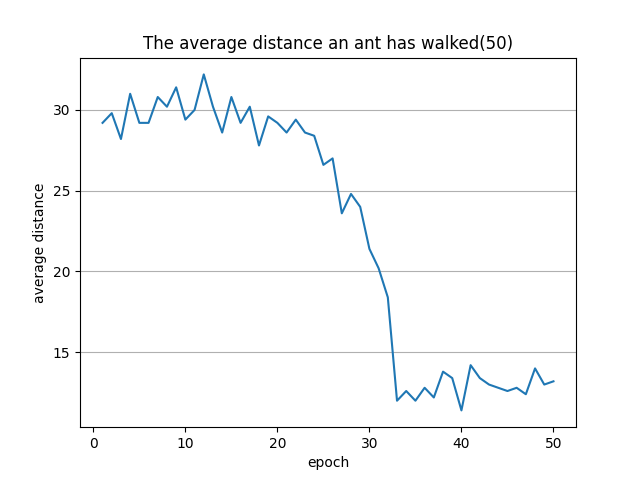

# ACOプログラムの使い方
ここでは[aco.py](aco.py)のパラメータを変更したときの挙動や、意味について記述する。

## ACOプログラムの概要
巣穴と餌場の間に9つの中間分岐点があるような地形を考える。  
分岐はすべて2方向の分岐で、それぞれの分岐ごとの道筋には一定の距離が割り当てられる。  
蟻コロニー最適化法によって、巣穴から餌場までの最短経路を辿る行動知識を獲得する！

### ACOプログラムのパラメータ
蟻の個体数：NOA = 20   
繰り返しの回数：ILIMIT = 50   
フェロモン更新の定数：Q = 3   
蒸発の定数：RHO = 0.8   
道のりのステップ数：STEP = 10   
行動選択のランダム性の決定：EPSILON = 0.15   
乱数のシード：SEED = 32767   

---

### 実験1
経路のコスト  
1. cost = [[1, 1, 1, 1, 1, 1, 1, 1, 1, 1],[5 ,5 ,5, 5, 5, 5, 5, 5, 5, 5]]  
2分岐経路のうち、左が0、右が1とすると  
左(cost[i][0])：コスト1  
右(cost[i][1])：コスト5  
***⇒最適な経路はすべて左に行くこと***

結果  
[[0, 0, 0, 0, 0, 0, 0, 0, 0, 0], [0, 0, 0, 0, 0, 0, 0, 0, 0, 0], [0, 0, 0, 0, 0, 0, 0, 0, 0, 1], [0, 0, 1, 0, 0, 0, 0, 0, 0, 0], [0, 0, 0, 0, 0, 0, 0, 0, 0, 0], [0, 0, 0, 0, 0, 0, 1, 0, 0, 1], [0, 0, 0, 0, 0, 0, 0, 0, 0, 0], [0, 0, 0, 1, 0, 0, 0, 0, 0, 0], [0, 0, 0, 1, 0, 0, 0, 0, 1, 0], [1, 0, 0, 0, 0, 0, 0, 0, 0, 0], [0, 0, 0, 0, 0, 0, 1, 0, 0, 1], [0, 0, 0, 0, 0, 0, 0, 0, 0, 1], [0, 0, 0, 1, 0, 0, 0, 0, 0, 0], [0, 0, 0, 0, 0, 0, 0, 0, 0, 0], [1, 0, 0, 0, 0, 0, 0, 0, 0, 0], [0, 1, 0, 0, 0, 0, 0, 0, 0, 0], [0, 0, 0, 0, 0, 0, 0, 0, 1, 0], [0, 0, 0, 0, 0, 0, 0, 0, 0, 0], [0, 0, 0, 0, 0, 0, 0, 0, 0, 0], [0, 0, 1, 0, 0, 0, 0, 0, 0, 0]]  

30回を超えて、大幅に平均距離が改善された。なぜ?

初期⇒フェロモンに差がなく、選ばれる確率が一様であるため、平均距離はあまり変わらない

中期⇒あるときたまたま距離が大幅に改善される個体が表れて、そこ周辺のフェロモン濃度が増加し、選択確率が指数関数的に増加して、短い経路ほど選ばれやすくなる。

後期⇒結果、ほとんどの個体が最短経路を辿るようになり、確率が収束していく。

---
