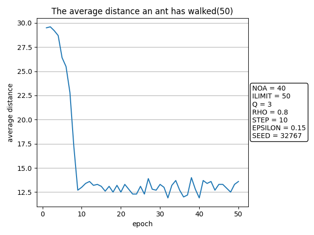
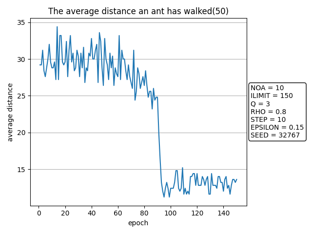
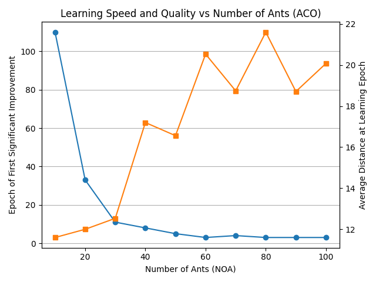

# ACOプログラムの使い方
ここでは[aco.py](aco.py)のパラメータを変更したときの挙動や、意味について記述する。

## ACOプログラムの概要
巣穴と餌場の間に9つの中間分岐点があるような地形を考える。  
分岐はすべて2方向の分岐で、それぞれの分岐ごとの道筋には一定の距離が割り当てられる。  
蟻コロニー最適化法によって、巣穴から餌場までの最短経路を辿る行動知識を獲得する！

### ACOプログラムのパラメータ
蟻の個体数：NOA = 20   
繰り返しの回数：ILIMIT = 50   
フェロモン更新の定数：Q = 3   
蒸発の定数：RHO = 0.8   
道のりのステップ数：STEP = 10   
行動選択のランダム性の決定：EPSILON = 0.15   
乱数のシード：SEED = 32767   

---

### 実験1
経路のコスト  
1. cost = [[1, 1, 1, 1, 1, 1, 1, 1, 1, 1],[5 ,5 ,5, 5, 5, 5, 5, 5, 5, 5]]  
2分岐経路のうち、左が0、右が1とすると  
左(cost[i][0])：コスト1  
右(cost[i][1])：コスト5  
***⇒最適な経路はすべて左に行くこと***

結果  
[[0, 0, 0, 0, 0, 0, 0, 0, 0, 0], [0, 0, 0, 0, 0, 0, 0, 0, 0, 0], [0, 0, 0, 0, 0, 0, 0, 0, 0, 1], [0, 0, 1, 0, 0, 0, 0, 0, 0, 0], [0, 0, 0, 0, 0, 0, 0, 0, 0, 0], [0, 0, 0, 0, 0, 0, 1, 0, 0, 1], [0, 0, 0, 0, 0, 0, 0, 0, 0, 0], [0, 0, 0, 1, 0, 0, 0, 0, 0, 0], [0, 0, 0, 1, 0, 0, 0, 0, 1, 0], [1, 0, 0, 0, 0, 0, 0, 0, 0, 0], [0, 0, 0, 0, 0, 0, 1, 0, 0, 1], [0, 0, 0, 0, 0, 0, 0, 0, 0, 1], [0, 0, 0, 1, 0, 0, 0, 0, 0, 0], [0, 0, 0, 0, 0, 0, 0, 0, 0, 0], [1, 0, 0, 0, 0, 0, 0, 0, 0, 0], [0, 1, 0, 0, 0, 0, 0, 0, 0, 0], [0, 0, 0, 0, 0, 0, 0, 0, 1, 0], [0, 0, 0, 0, 0, 0, 0, 0, 0, 0], [0, 0, 0, 0, 0, 0, 0, 0, 0, 0], [0, 0, 1, 0, 0, 0, 0, 0, 0, 0]]  

30回を超えて、大幅に平均距離が改善された。なぜ?

初期⇒フェロモンに差がなく、選ばれる確率が一様であるため、平均距離はあまり変わらない

中期⇒あるときたまたま距離が大幅に改善される個体が表れて、そこ周辺のフェロモン濃度が増加し、選択確率が指数関数的に増加して、短い経路ほど選ばれやすくなる。

後期⇒結果、ほとんどの個体が最短経路を辿るようになり、確率が収束していく。

---

### 実験2
変更パラメータ  
<mark>蟻の個体数：`NOA = 20`</mark>   
繰り返しの回数：`ILIMIT = 50`   
フェロモン更新の定数：`Q = 3`   
蒸発の定数：RHO = `0.8`   
道のりのステップ数：`STEP = 10`   
行動選択のランダム性の決定：`EPSILON = 0.15`   
乱数のシード：`SEED = 32767` 

- 個体数の増減  
予想：増加 → 収束の速さが2倍になる  
減少 → 収束の速さが0.5倍になる

#### 【結果】
NOA = 40  
 

NOA = 10, ILIMIT = 150  

NOA = 40の時：収束は8-9回で起き、約1/3回程度に短縮された

NOA = 10の時：収束は約90回で起き、約3倍の回数かかった。

⇒ 個体数と学習スピードの関係性は...?

NOA = 10~100で、個体数を10体ずつ増やして、平均距離が22%減少したタイミングの回数をそれぞれ記録する。  

 

詳細な実験結果（クリックで展開）

| 個体数 | 学習回数 | 平均距離 |
| --- | --- | --- | 
| 10 | 110 | 11.6 |
| 20 | 33 | 12.0 |
| 30 | 11 | 12.5 |
| 40 | 8 | 17.2 |
| 50 | 5 | 16.5 |
| 60 | 3 | 20.5 |
| 70 | 4 | 18.7 |
| 80 | 3 | 21.6 |
| 90 | 3 | 18.7 |
| 100 | 3 | 20.1 |

回数に関しては、30体以上は大きく改善されることはなかった。  
平均距離に関しては、個体数が増えるほど、距離が増えていった。

#### ここから言えること
- 個体数が増えると、すぐに収束するが局所最適解に収束する。
- 解の質を考慮すると、**適度な個体数**で繰り返すことが必要

